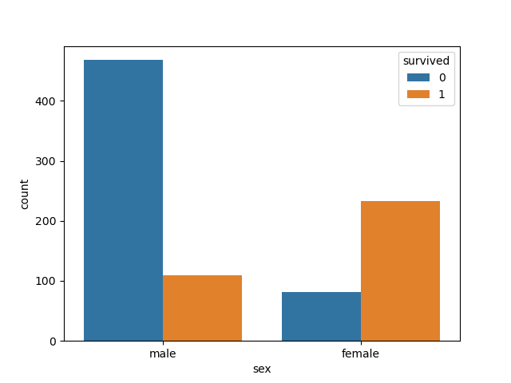
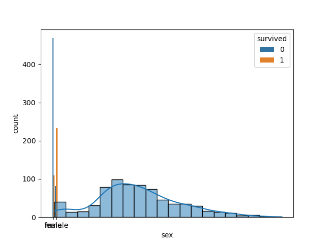
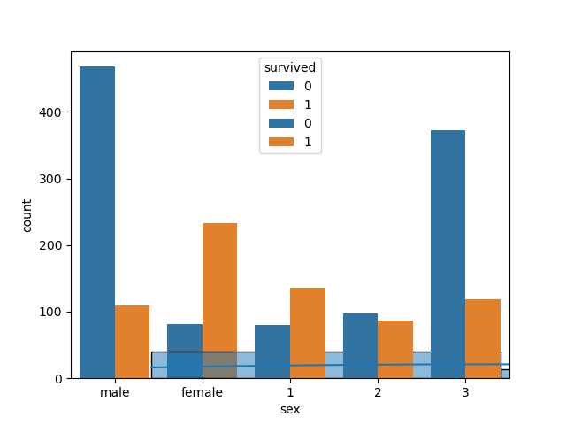
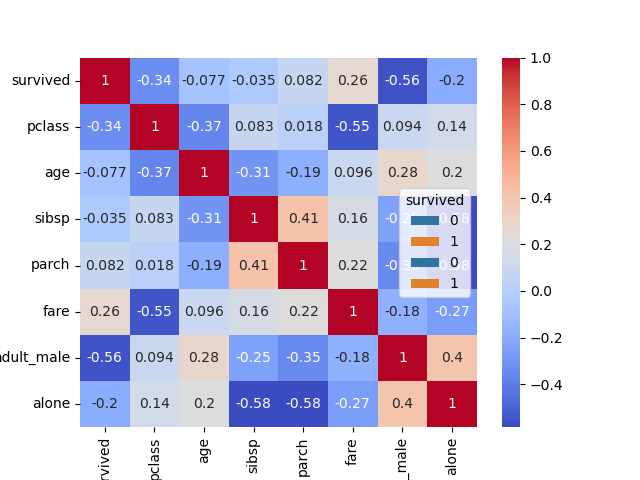

# Titanic Dataset EDA and Data Cleaning Report

## Dataset Overview
- Rows: 891
- Columns: 15

## Cleaning Summary
- Dropped `deck` due to missing values
- Filled `age` with median
- Filled `embarked` and `embark_town` with mode
- Dropped remaining missing rows

## Summary Stats
|             |   count |   unique | top         |   freq |       mean |        std |    min |      25% |      50% |   75% |     max |
|:------------|--------:|---------:|:------------|-------:|-----------:|-----------:|-------:|---------:|---------:|------:|--------:|
| survived    |     891 |      nan | nan         |    nan |   0.383838 |   0.486592 |   0    |   0      |   0      |     1 |   1     |
| pclass      |     891 |      nan | nan         |    nan |   2.30864  |   0.836071 |   1    |   2      |   3      |     3 |   3     |
| sex         |     891 |        2 | male        |    577 | nan        | nan        | nan    | nan      | nan      |   nan | nan     |
| age         |     714 |      nan | nan         |    nan |  29.6991   |  14.5265   |   0.42 |  20.125  |  28      |    38 |  80     |
| sibsp       |     891 |      nan | nan         |    nan |   0.523008 |   1.10274  |   0    |   0      |   0      |     1 |   8     |
| parch       |     891 |      nan | nan         |    nan |   0.381594 |   0.806057 |   0    |   0      |   0      |     0 |   6     |
| fare        |     891 |      nan | nan         |    nan |  32.2042   |  49.6934   |   0    |   7.9104 |  14.4542 |    31 | 512.329 |
| embarked    |     889 |        3 | S           |    644 | nan        | nan        | nan    | nan      | nan      |   nan | nan     |
| class       |     891 |        3 | Third       |    491 | nan        | nan        | nan    | nan      | nan      |   nan | nan     |
| who         |     891 |        3 | man         |    537 | nan        | nan        | nan    | nan      | nan      |   nan | nan     |
| adult_male  |     891 |        2 | True        |    537 | nan        | nan        | nan    | nan      | nan      |   nan | nan     |
| deck        |     203 |        7 | C           |     59 | nan        | nan        | nan    | nan      | nan      |   nan | nan     |
| embark_town |     889 |        3 | Southampton |    644 | nan        | nan        | nan    | nan      | nan      |   nan | nan     |
| alive       |     891 |        2 | no          |    549 | nan        | nan        | nan    | nan      | nan      |   nan | nan     |
| alone       |     891 |        2 | True        |    537 | nan        | nan        | nan    | nan      | nan      |   nan | nan     |

## Visualizations
  
  
  
  

## Insights
- Women had significantly higher survival rates.
- Passengers in 1st class had the highest survival rate.
- Fare shows moderate correlation with survival.
- Younger passengers survived more often.

